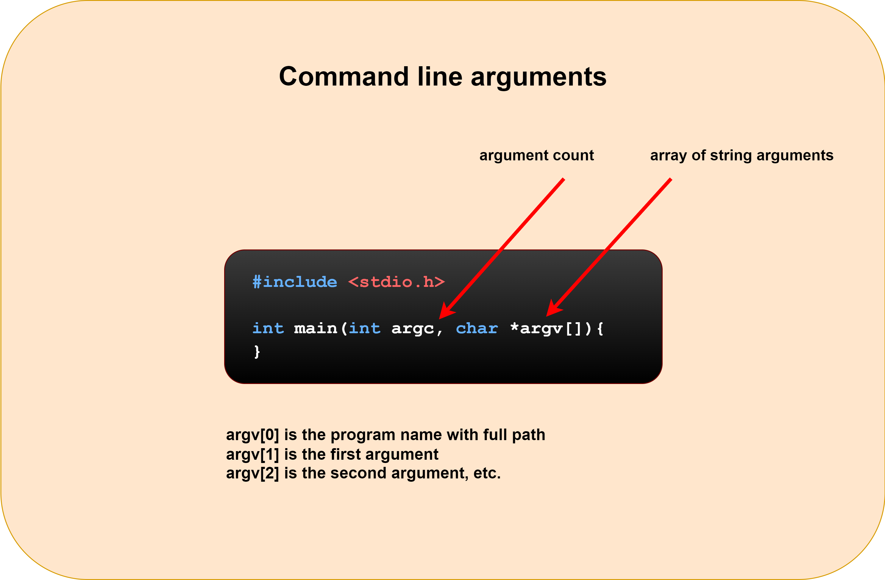

<div align="center">
<br>



</div>


<p align="center">


</p>


<h1 align="center"> C - argc, argv </h1>


<h3 align="center">
<a href="https://github.com/SuleimanHajizadeh/holbertonschool-low_level_programming/argc_argv#eye-about">About</a> •
<a href="https://github.com/RazikaBengana/holbertonschool-low_level_programming/argc_argv#hammer_and_wrench-tasks">Tasks</a> •
<a href="https://github.com/RazikaBengana/holbertonschool-low_level_programming/argc_arg#memo-learning-objectives">Learning Objectives</a> •
<a href="https://github.com/RazikaBengana/holbertonschool-low_level_programming/argc_argv#computer-requirements">Requirements</a> •
<a href="https://github.com/RazikaBengana/holbertonschool-low_level_programming/argc_argv#mag_right-resources">Resources</a> •
<a href="https://github.com/RazikaBengana/holbertonschool-low_level_programming/argc_argv#bust_in_silhouette-authors">Authors</a> •
<a href="https://github.com/RazikaBengana/holbertonschool-low_level_programming/argc_argv#octocat-license">License</a>
</h3>

---

<!-- ------------------------------------------------------------------------------------------------- -->

<br>
<br>

## :eye: About

<br>

<div align="center">

**`C - argv, argc`** theme explores command-line argument handling in C programs, introducing the concepts of argument count (`argc`) and argument vector (`argv`).
<br>
The programs demonstrate various ways to work with command-line arguments, including printing the program name, counting arguments, displaying all arguments, performing operations on numeric arguments, and handling errors when insufficient arguments are provided.
<br>
<br>
This project has been created by **[Holberton School](https://www.holbertonschool.com/about-holberton)** to enable every student to understand how C language works.

</div>

<br>
<br>

<!-- ------------------------------------------------------------------------------------------------- -->

## :hammer_and_wrench: Tasks

<br>

**`0. It ain't what they call you, it's what you answer to`**

**`1. Silence is argument carried out by other means`**

**`2. The best argument against democracy is a five-minute conversation with the average voter`**

**`3. Neither irony nor sarcasm is argument`**

**`4. To infinity and beyond`**

**`5. Minimal Number of Coins for Change`**

<br>
<br>

<!-- ------------------------------------------------------------------------------------------------- -->

## :memo: Learning Objectives

<br>

**_You are expected to be able to [explain to anyone](https://fs.blog/feynman-learning-technique/), without the help of Google:_**

<br>

```diff

General

+ How to use arguments passed to your program

+ What are two prototypes of main that you know of, and in which case do you use one or the other

+ How to use __attribute__((unused)) or (void) to compile functions with unused variables or parameters

```

<br>
<br>

<!-- ------------------------------------------------------------------------------------------------- -->

## :computer: Requirements

<br>

```diff

General

+ Allowed editors: vi, vim, emacs

+ All your files will be compiled on Ubuntu 20.04 LTS using gcc, using the options -Wall -Werror -Wextra -pedantic -std=gnu89

+ All your files should end with a new line

+ A README.md file, at the root of the folder of the project is mandatory

+ Your code should use the Betty style. It will be checked using betty-style.pl and betty-doc.pl

- You are not allowed to use global variables

+ No more than 5 functions per file

+ The prototypes of all your functions and the prototype of the function _putchar should be included in your header file called main.h

+ Don’t forget to push your header file

+ You are allowed to use the standard library

```

<br>

**_Why all your files should end with a new line? See [HERE](https://unix.stackexchange.com/questions/18743/whats-the-point-in-adding-a-new-line-to-the-end-of-a-file/18789)_**

<br>
<br>

<!-- ------------------------------------------------------------------------------------------------- -->

## :mag_right: Resources

<br>

**_Do you need some help?_**

<br>

**Read or watch:**

* [Arguments to main](https://publications.gbdirect.co.uk//c_book/chapter10/arguments_to_main.html)

* [argc and argv](http://crasseux.com/books/ctutorial/argc-and-argv.html)

* [What does argc and argv mean?](https://www.youtube.com/watch?v=aP1ijjeZc24)

* [how to compile with unused variables](https://www.google.com/webhp?q=unused+variable+C)

<br>
<br>

<!-- ------------------------------------------------------------------------------------------------- -->

## :bust_in_silhouette: Authors

<br>


<br>
<br>

<!-- ------------------------------------------------------------------------------------------------- -->

## :octocat: License

<br>

```C - argv, argc``` _project has no license specified._

<br>
<br>

---

<p align="center"><br>2022</p>
