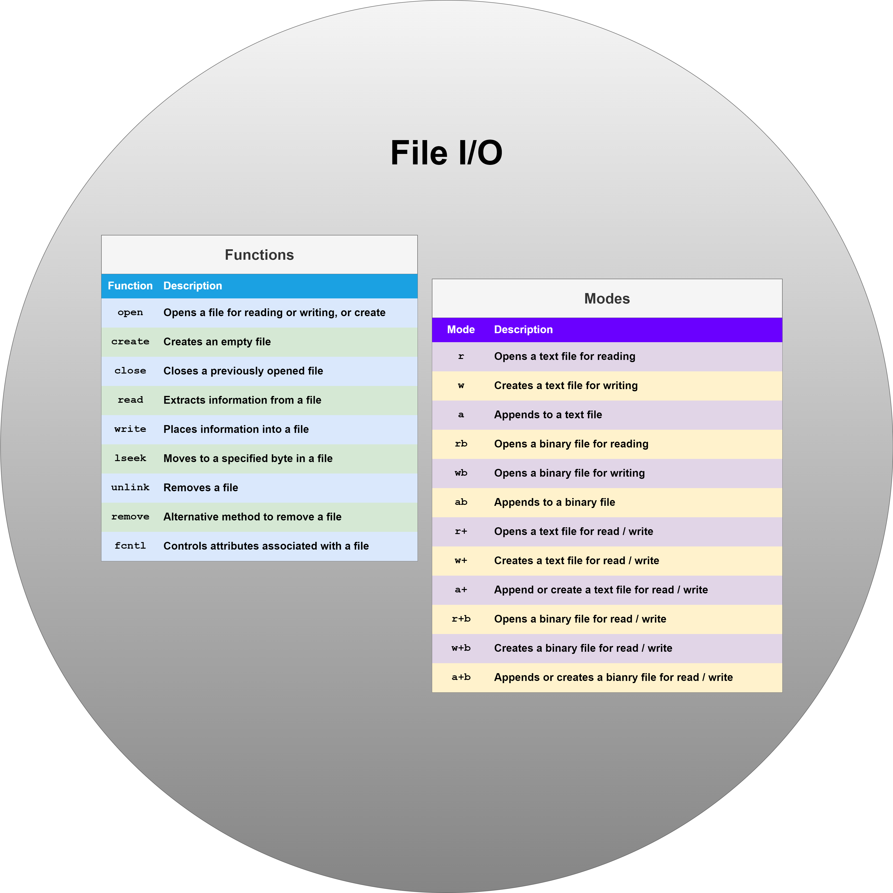

<div align="center">
<br>



</div>


<p align="center">


</p>


<h1 align="center"> C - File I/O </h1>


<h3 align="center">
<a href="https://github.com/RazikaBengana/holbertonschool-low_level_programming/tree/main/file_io#eye-about">About</a> •
<a href="https://github.com/RazikaBengana/holbertonschool-low_level_programming/tree/main/file_io#hammer_and_wrench-tasks">Tasks</a> •
<a href="https://github.com/RazikaBengana/holbertonschool-low_level_programming/tree/main/file_io#memo-learning-objectives">Learning Objectives</a> •
<a href="https://github.com/RazikaBengana/holbertonschool-low_level_programming/tree/main/file_io#computer-requirements">Requirements</a> •
<a href="https://github.com/RazikaBengana/holbertonschool-low_level_programming/tree/main/file_io#mag_right-resources">Resources</a> •
<a href="https://github.com/RazikaBengana/holbertonschool-low_level_programming/tree/main/file_io#bust_in_silhouette-authors">Authors</a> •
<a href="https://github.com/RazikaBengana/holbertonschool-low_level_programming/tree/main/file_io#octocat-license">License</a>
</h3>

---

<!-- ------------------------------------------------------------------------------------------------- -->

<br>
<br>

## :eye: About

<br>

<div align="center">

**`C - file I/O`** theme explores the fundamental concepts of file input/output operations in C programming, focusing on interacting with the file system.
<br>
The programs implement various file manipulation tasks, including reading and printing text file contents, creating new files with specified content, appending text to existing files, copying file contents from one file to another, and even working with more advanced concepts like reading and analyzing ELF file headers.
<br>
<br>
This project has been created by **[Holberton School](https://www.holbertonschool.com/about-holberton)** to enable every student to understand how C language works.

</div>

<br>
<br>

<!-- ------------------------------------------------------------------------------------------------- -->

## :hammer_and_wrench: Tasks

<br>

**`0. Tread lightly, she is near`**

**`1. Under the snow`**

**`2. Speak gently, she can hear`**

**`3. cp`**

**`4. elf`**

<br>
<br>

<!-- ------------------------------------------------------------------------------------------------- -->

## :memo: Learning Objectives

<br>

**_You are expected to be able to [explain to anyone](https://fs.blog/feynman-learning-technique/), without the help of Google:_**

<br>

```diff

General

+ Look for the right source of information online

+ How to create, open, close, read and write files

+ What are file descriptors

+ What are the 3 standard file descriptors, what are their purpose and what are their POSIX names

+ How to use the I/O system calls open, close, read and write

+ What are and how to use the flags O_RDONLY, O_WRONLY, O_RDWR

+ What are file permissions, and how to set them when creating a file with the open system call

+ What is a system call

+ What is the difference between a function and a system call

```

<br>
<br>

<!-- ------------------------------------------------------------------------------------------------- -->

## :computer: Requirements

<br>

```diff

General

+ Allowed editors: vi, vim, emacs

+ All your files will be compiled on Ubuntu 20.04 LTS using gcc, using the options -Wall -Werror -Wextra -pedantic -std=gnu89

+ All your files should end with a new line

+ A README.md file, at the root of the folder of the project is mandatory

+ Your code should use the Betty style. It will be checked using betty-style.pl and betty-doc.pl

- You are not allowed to use global variables

+ No more than 5 functions per file

+ The only C standard library functions allowed are malloc, free and exit

- Any use of functions like printf, puts, calloc, realloc etc… is forbidden

+ Allowed syscalls: read, write, open, close

+ You are allowed to use _putchar

- You don’t have to push _putchar.c, we will use our file. If you do it won’t be taken into account

+ In the following examples, the main.c files are shown as examples. <br> You can use them to test your functions, but you don’t have to push them to your repo (if you do we won’t take them into account). <br> We will use our own main.c files at compilation. <br> Our main.c files might be different from the one shown in the examples

+ The prototypes of all your functions and the prototype of the function _putchar should be included in your header file called main.h

+ Don’t forget to push your header file

+ All your header files should be include guarded

+ Tip: always prefer using symbolic constants (POSIX) vs numbers when it makes sense. For instance read(STDIN_FILENO, ... vs read(0, ...

```

<br>

**_Why all your files should end with a new line? See [HERE](https://unix.stackexchange.com/questions/18743/whats-the-point-in-adding-a-new-line-to-the-end-of-a-file/18789)_**

<br>
<br>

<!-- ------------------------------------------------------------------------------------------------- -->

## :mag_right: Resources

<br>

**_Do you need some help?_**

<br>

**Read or watch:**

* [File descriptors](https://en.wikipedia.org/wiki/File_descriptor)

* [How to Use the I/O System Calls Open, Close, Read and Write](https://medium.com/@muirujackson/how-to-use-the-i-o-system-calls-open-close-read-and-write-f6f80dc61e2a)

* [C Programming in Linux Tutorial - open() read() write() Functions](https://www.youtube.com/watch?v=WxNSJAbQ8Ik&ab_channel=DexTutor)

<br>

**`man` or `help`:**

* `open`

* `close`

* `read`

* `write`

* `dprintf`

<br>
<br>

<!-- ------------------------------------------------------------------------------------------------- -->

## :bust_in_silhouette: Authors

<br>


<br>
<br>

<!-- ------------------------------------------------------------------------------------------------- -->

## :octocat: License

<br>

```C - file I/O``` _project has no license specified._

<br>
<br>

---

<p align="center"><br>2022</p>