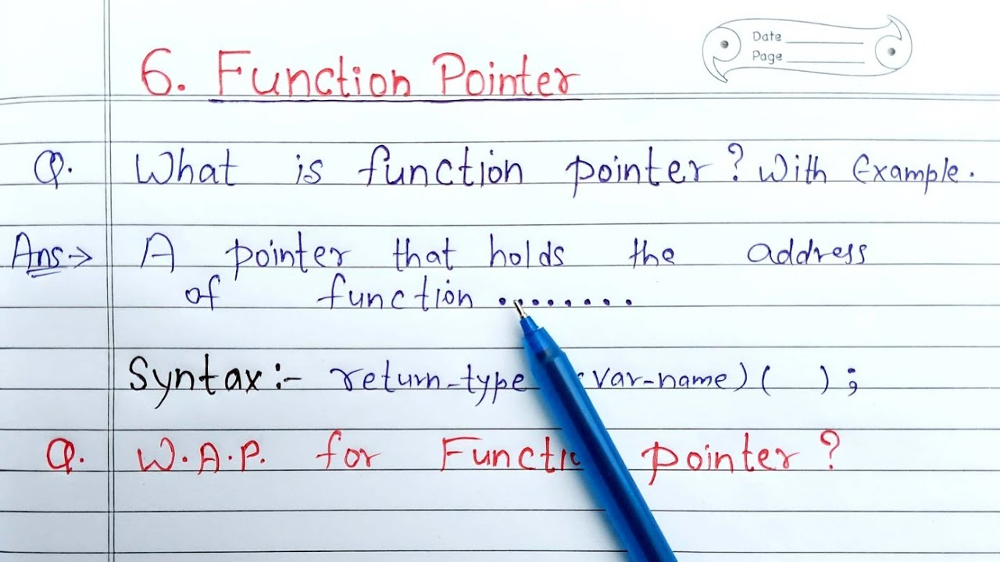

<div align="center">
<br>



</div>


<p align="center">


</p>


<h1 align="center"> C - Function pointers </h1>


<h3 align="center">
<a href="https://github.com/SuleimanHajizadeh/holbertonschool-low_level_programming/tree/master/function_pointers#eye-about">About</a> •
<a href="https://github.com/SuleimanHajizadeh/holbertonschool-low_level_programming/tree/master/function_pointers#hammer_and_wrench-tasks">Tasks</a> •
<a href="https://github.com/SuleimanHajizadeh/holbertonschool-low_level_programming/tree/master/function_pointers#memo-learning-objectives">Learning Objectives</a> •
<a href="https://github.com/SuleimanHajizadeh/holbertonschool-low_level_programming/tree/master/function_pointers#computer-requirements">Requirements</a> •
<a href="https://github.com/SuleimanHajizadeh/holbertonschool-low_level_programming/tree/master/function_pointers#mag_right-resources">Resources</a> •
<a href="https://github.com/SuleimanHajizadeh/holbertonschool-low_level_programming/tree/master/function_pointers#bust_in_silhouette-authors">Authors</a> •
<a href="https://github.com/SuleimanHajizadeh/holbertonschool-low_level_programming/tree/master/function_pointers#octocat-license">License</a>
</h3>

---

<!-- ------------------------------------------------------------------------------------------------- -->

<br>
<br>

## :eye: About

<br>

<div align="center">

**`C - function pointers`** theme explores the concept of using pointers to functions as arguments and variables in C programming.
<br>
The programs demonstrate various applications of function pointers, including creating functions that take function pointers as arguments to perform operations on arrays, searching for integers, and implementing a simple calculator that uses function pointers to select the appropriate arithmetic operation based on user input.
<br>
<br>
This project has been created by **[Holberton School](https://www.holbertonschool.com/about-holberton)** to enable every student to understand how C language works.

</div>

<br>
<br>

<!-- ------------------------------------------------------------------------------------------------- -->

## :hammer_and_wrench: Tasks

<br>

**`0. What's my name`**

**`1. If you spend too much time thinking about a thing, you'll never get it done`**

**`2. To hell with circumstances; I create opportunities`**

**`3. A goal is not always meant to be reached, it often serves simply as something to aim at`**

**`4. Most hackers are young because young people tend to be adaptable. As long as you remain adaptable, you can always be a good hacker`**

<br>
<br>

<!-- ------------------------------------------------------------------------------------------------- -->

## :memo: Learning Objectives

<br>

**_You are expected to be able to [explain to anyone](https://fs.blog/feynman-learning-technique/), without the help of Google:_**

<br>

```diff

General

+ What are function pointers and how to use them

+ What does a function pointer exactly hold

+ Where does a function pointer point to in the virtual memory

```

<br>
<br>

<!-- ------------------------------------------------------------------------------------------------- -->

## :computer: Requirements

<br>

```diff

General

+ Allowed editors: vi, vim, emacs

+ All your files will be compiled on Ubuntu 20.04 LTS using gcc, using the options -Wall -Werror -Wextra -pedantic -std=gnu89

+ All your files should end with a new line

+ A README.md file, at the root of the folder of the project is mandatory

+ Your code should use the Betty style. It will be checked using betty-style.pl and betty-doc.pl

- You are not allowed to use global variables

+ No more than 5 functions per file

+ The only C standard library functions allowed are malloc, free and exit

- Any use of functions like printf, puts, calloc, realloc etc… is forbidden

+ You are allowed to use _putchar

- You don’t have to push _putchar.c, we will use our file. If you do it won’t be taken into account

+ In the following examples, the main.c files are shown as examples. <br> You can use them to test your functions, but you don’t have to push them to your repo (if you do we won’t take them into account). <br> We will use our own main.c files at compilation. <br> Our main.c files might be different from the one shown in the examples

+ The prototypes of all your functions and the prototype of the function _putchar should be included in your header file called function_pointers.h

+ Don’t forget to push your header file

+ All your header files should be include guarded

```

<br>

**_Why all your files should end with a new line? See [HERE](https://unix.stackexchange.com/questions/18743/whats-the-point-in-adding-a-new-line-to-the-end-of-a-file/18789)_**

<br>
<br>

<!-- ------------------------------------------------------------------------------------------------- -->

## :mag_right: Resources

<br>

**_Do you need some help?_**

<br>

**Read or watch:**

* [Function Pointer in C](https://www.geeksforgeeks.org/function-pointer-in-c/)

* [Pointers to functions](https://publications.gbdirect.co.uk//c_book/chapter5/function_pointers.html)

* [Function Pointers in C / C++](https://www.youtube.com/watch?v=ynYtgGUNelE)

* [why pointers to functions?](https://www.youtube.com/watch?v=sxTFSDAZM8s&feature=youtu.be)

* [Everything you need to know about pointers in C](https://boredzo.org/pointers/)

<br>
<br>

<!-- ------------------------------------------------------------------------------------------------- -->

## :bust_in_silhouette: Authors

<br>


<br>
<br>

<!-- ------------------------------------------------------------------------------------------------- -->

## :octocat: License

<br>

```C - function pointers``` _project has no license specified._

<br>
<br>

---

<p align="center"><br>2025</p>
