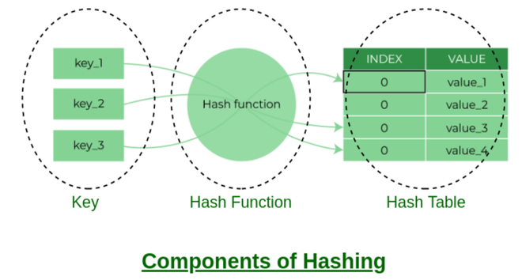

<div align="center">
<br>



</div>


<p align="center">


</p>


<h1 align="center"> C - Hash tables </h1>


<h3 align="center">
<a href="https://github.com/RazikaBengana/holbertonschool-low_level_programming/tree/main/hash_tables#eye-about">About</a> •
<a href="https://github.com/RazikaBengana/holbertonschool-low_level_programming/tree/main/hash_tables#hammer_and_wrench-tasks">Tasks</a> •
<a href="https://github.com/RazikaBengana/holbertonschool-low_level_programming/tree/main/hash_tables#memo-learning-objectives">Learning Objectives</a> •
<a href="https://github.com/RazikaBengana/holbertonschool-low_level_programming/tree/main/hash_tables#computer-requirements">Requirements</a> •
<a href="https://github.com/RazikaBengana/holbertonschool-low_level_programming/tree/main/hash_tables#keyboard-more-info">More Info</a> •
<a href="https://github.com/RazikaBengana/holbertonschool-low_level_programming/tree/main/hash_tables#mag_right-resources">Resources</a> •
<a href="https://github.com/RazikaBengana/holbertonschool-low_level_programming/tree/main/hash_tables#bust_in_silhouette-authors">Authors</a> •
<a href="https://github.com/RazikaBengana/holbertonschool-low_level_programming/tree/main/hash_tables#octocat-license">License</a>
</h3>

---

<!-- ------------------------------------------------------------------------------------------------- -->

<br>
<br>

## :eye: About

<br>

<div align="center">

**`C - hash tables`** theme explores the implementation and usage of hash table data structures in C programming, focusing on efficient key-value pair storage and retrieval.
<br>
The programs implement various hash table operations such as creating a hash table, generating hash values for strings, setting and retrieving key-value pairs, printing the contents of a hash table, and deleting a hash table, as well as an advanced implementation of a sorted hash table.
<br>
<br>
This project has been created by **[Holberton School](https://www.holbertonschool.com/about-holberton)** to enable every student to understand how C language works.

</div>

<br>
<br>

<!-- ------------------------------------------------------------------------------------------------- -->

## :hammer_and_wrench: Tasks

<br>

**`0. >>> ht = {}`**

**`1. djb2`**

**`2. key -> index`**

**`3. >>> ht['betty'] = 'cool'`**

**`4. >>> ht['betty']`**

**`5. >>> print(ht)`**

**`6. >>> del ht`**

**`7. $ht['Betty'] = 'Cool'`**

<br>
<br>

<!-- ------------------------------------------------------------------------------------------------- -->

## :memo: Learning Objectives

<br>

**_You are expected to be able to [explain to anyone](https://fs.blog/feynman-learning-technique/), without the help of Google:_**

<br>

```diff

General

+ What is a hash function

+ What makes a good hash function

+ What is a hash table, how do they work and how to use them

+ What is a collision and what are the main ways of dealing with collisions in the context of a hash table

+ What are the advantages and drawbacks of using hash tables

+ What are the most common use cases of hash tables

```

<br>
<br>

<!-- ------------------------------------------------------------------------------------------------- -->

## :computer: Requirements

<br>

```diff

General

+ Allowed editors: vi, vim, emacs

+ All your files will be compiled on Ubuntu 20.04 LTS using gcc, using the options -Wall -Werror -Wextra -pedantic -std=gnu89

+ All your files should end with a new line

+ A README.md file, at the root of the folder of the project is mandatory

+ Your code should use the Betty style. It will be checked using betty-style.pl and betty-doc.pl

- You are not allowed to use global variables

+ No more than 5 functions per file

+ You are allowed to use the C standard library

+ The prototypes of all your functions should be included in your header file called hash_tables.h

+ Don’t forget to push your header file

+ All your header files should be include guarded

```

<br>

**_Why all your files should end with a new line? See [HERE](https://unix.stackexchange.com/questions/18743/whats-the-point-in-adding-a-new-line-to-the-end-of-a-file/18789)_**

<br>
<br>

<!-- ------------------------------------------------------------------------------------------------- -->

## :keyboard: More Info

<br>

### Data Structures:

<br>

- Please use this data structure for this project:

<br>

```c
/**
 * struct hash_node_s - Node of a hash table
 *
 * @key: The key, string
 * The key is unique in the HashTable
 * @value: The value corresponding to a key
 * @next: A pointer to the next node of the List
 */

typedef struct hash_node_s
{
    char *key;
    char *value;
    struct hash_node_s *next;
} hash_node_t;


/**
 * struct hash_table_s - Hash table data structure
 *
 * @size: The size of the array
 * @array: An array of size @size
 * Each cell of this array is a pointer to the first node of a linked list,
 * because we want our HashTable to use a Chaining collision handling
 */

typedef struct hash_table_s
{
    unsigned long int size;
    hash_node_t **array;
} hash_table_t;
```

<br>
<br>

### Tests:

<br>

- We strongly encourage you to work all together on a set of tests.

<br>
<br>

### Python Dictionaries:

<br>

- Python dictionaries are implemented using hash tables.

  When you will be done with this project, you will be able to better understand the power and simplicity of Python dictionaries.

  So much is actually happening when you type `d = {'a': 1, 'b': 2}`, but everything looks so simple for the user.

  Python doesn’t use the exact same implementation than the one you will work on today though. 

  If you are curious on how it works under the hood, here is a good blog post about [how dictionaries are implemented in Python 2.7](https://www.laurentluce.com/posts/python-dictionary-implementation/).

  Note that all dictionaries are not implemented using hash tables and there is a difference between a dictionary and a hash table.

  [Read more here](https://stackoverflow.com/questions/2061222/what-is-the-true-difference-between-a-dictionary-and-a-hash-table).

<br>
<br>

<!-- ------------------------------------------------------------------------------------------------- -->

## :mag_right: Resources

<br>

**_Do you need some help?_**

<br>

**Read or watch:**

* [What is a HashTable Data Structure - Introduction to Hash Tables , Part 0](https://www.youtube.com/watch?v=MfhjkfocRR0)

* [Hash function](https://en.wikipedia.org/wiki/Hash_function)

* [Hash table](https://en.wikipedia.org/wiki/Hash_table)

<br>
<br>

<!-- ------------------------------------------------------------------------------------------------- -->

## :bust_in_silhouette: Authors

<br>


<br>
<br>

<!-- ------------------------------------------------------------------------------------------------- -->

## :octocat: License

<br>

```C - hash tables``` _project has no license specified._

<br>
<br>

---

<p align="center"><br>2022</p>