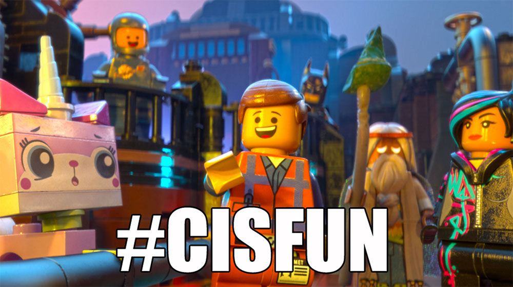

<div align="center">
<br>



</div>


<p align="center">


</p>


<h1 align="center"> C - Hello, World </h1>


<h3 align="center">
<a href="https://github.com/RazikaBengana/holbertonschool-low_level_programming/tree/main/hello_world#eye-about">About</a> •
<a href="https://github.com/RazikaBengana/holbertonschool-low_level_programming/tree/main/hello_world#hammer_and_wrench-tasks">Tasks</a> •
<a href="https://github.com/RazikaBengana/holbertonschool-low_level_programming/tree/main/hello_world#memo-learning-objectives">Learning Objectives</a> •
<a href="https://github.com/RazikaBengana/holbertonschool-low_level_programming/tree/main/hello_world#computer-requirements">Requirements</a> •
<a href="https://github.com/RazikaBengana/holbertonschool-low_level_programming/tree/main/hello_world#keyboard-more-info">More Info</a> •
<a href="https://github.com/RazikaBengana/holbertonschool-low_level_programming/tree/main/hello_world#mag_right-resources">Resources</a> •
<a href="https://github.com/RazikaBengana/holbertonschool-low_level_programming/tree/main/hello_world#bust_in_silhouette-authors">Authors</a> •
<a href="https://github.com/RazikaBengana/holbertonschool-low_level_programming/tree/main/hello_world#octocat-license">License</a>
</h3>

---

<!-- ------------------------------------------------------------------------------------------------- -->

<br>
<br>

## :eye: About

<br>

<div align="center">

**`C - hello, World`** theme introduces beginners to basic C programming concepts and the compilation process.
<br>
It covers writing simple C programs that print to the console, as well as using the GCC compiler to preprocess, compile, assemble, and link C code.
<br>
<br>
This project has been created by **[Holberton School](https://www.holbertonschool.com/about-holberton)** to enable every student to understand how C language works.

</div>

<br>
<br>

<!-- ------------------------------------------------------------------------------------------------- -->

## :hammer_and_wrench: Tasks

<br>

**`0. Preprocessor`**

**`1. Compiler`**

**`2. Assembler`**

**`3. Name`**

**`4. Hello, puts`**

**`5. Hello, printf`**

**`6. Size is not grandeur, and territory does not make a nation`**

**`7. What happens when you type gcc main.c`** 

**`8. Intel`**

**`9. UNIX is basically a simple operating system, but you have to be a genius to understand the simplicity`**

<br>
<br>

<!-- ------------------------------------------------------------------------------------------------- -->

## :memo: Learning Objectives

<br>

**_You are expected to be able to [explain to anyone](https://fs.blog/feynman-learning-technique/), without the help of Google:_**

<br>

```diff

General

+ Why C programming is awesome

+ Who invented C

+ Who are Dennis Ritchie, Brian Kernighan and Linus Torvalds

+ What happens when you type gcc main.c

+ What is an entry point

+ What is a main

+ How to print text using printf, puts and putchar

+ How to get the size of a specific type using the unary operator sizeof

+ How to compile using gcc

+ What is the default program name when compiling with gcc

+ What is the official C coding style and how to check your code with betty-style

+ How to find the right header to include in your source code when using a standard library function

+ How does the main function influence the return value of the program

```

<br>
<br>

<!-- ------------------------------------------------------------------------------------------------- -->

## :computer: Requirements

<br>

```diff

C

+ Allowed editors: vi, vim, emacs

+ All your files will be compiled on Ubuntu 20.04 LTS using gcc, using the options -Wall -Werror -Wextra -pedantic -std=gnu89

+ All your files should end with a new line

+ A README.md file at the root of the repo, containing a description of the repository

+ A README.md file, at the root of the folder of this project, containing a description of the project

+ There should be no errors and no warnings during compilation

- You are not allowed to use system

+ Your code should use the Betty style. It will be checked using betty-style.pl and betty-doc.pl


Shell Scripts 

+ Allowed editors: vi, vim, emacs

+ All your scripts will be tested on Ubuntu 20.04 LTS

+ All your scripts should be exactly two lines long ($ wc -l file should print 2)

+ All your files should end with a new line

+ The first line of all your files should be exactly #!/bin/bash

```

<br>

**_Why all your files should end with a new line? See [HERE](https://unix.stackexchange.com/questions/18743/whats-the-point-in-adding-a-new-line-to-the-end-of-a-file/18789)_**

<br>
<br>

<!-- ------------------------------------------------------------------------------------------------- -->

## :keyboard: More Info

<br>

### Betty linter:

<br>

- To run the **Betty linter** just with command `betty <filename>`:

  - Go to the [Betty](https://github.com/hs-hq/Betty) repository
  
  - Clone the [repo](https://github.com/hs-hq/Betty) to your local machine
  
  - `cd` into the Betty directory
  
  - Install the linter with `sudo ./install.sh`
  
  - `emacs` or `vi` a new file called `betty`, and copy the script below:
  
  <br>
  <br>

    ```bash
    #!/bin/bash
    # Simply a wrapper script to keep you from having to use betty-style
    # and betty-doc separately on every item.
    # Originally by Tim Britton (@wintermanc3r), multiargument added by
    # Larry Madeo (@hillmonkey)

    BIN_PATH="/usr/local/bin"
    BETTY_STYLE="betty-style"
    BETTY_DOC="betty-doc"

    if [ "$#" = "0" ]; then
    echo "No arguments passed."
    exit 1
    fi

    for argument in "$@" ; do
    echo -e "\n========== $argument =========="
    ${BIN_PATH}/${BETTY_STYLE} "$argument"
    ${BIN_PATH}/${BETTY_DOC} "$argument"
    done
    ```
  
  <br>

  - Once saved, exit the file and change permissions to apply to all users with `chmod a+x betty`
  
  - Move the `betty` file into `/bin/` directory or somewhere else in your `$PATH` with `sudo mv betty /bin/`


<br>

You can now type `betty <filename>` to run the Betty linter!

<br>
<br>

<!-- ------------------------------------------------------------------------------------------------- -->

## :mag_right: Resources

<br>

**_Do you need some help?_**

<br>

**Read or watch:**

* [Everything you need to know to start with C.pdf](https://drive.google.com/file/d/139mmrHcmDa5HlpXORCTH8xAQ5HQoA2uX/view?usp=sharing)

* [Dennis Ritchie](https://en.wikipedia.org/wiki/Dennis_Ritchie)

* [“C” Programming Language: Brian Kernighan](https://www.youtube.com/watch?v=de2Hsvxaf8M)

* [Why C Programming Is Awesome](https://www.youtube.com/watch?v=smGalmxPVYc)

* [Learning to program in C part 1](https://www.youtube.com/watch?v=rk2fK2IIiiQ)

* [Learning to program in C part 2](https://www.youtube.com/watch?v=FwpP_MsZWnU)

* [Understanding C program Compilation Process](https://www.youtube.com/watch?v=VDslRumKvRA)

* [Betty Coding Style](https://github.com/hs-hq/Betty/wiki)

* [Hash-bang under the hood](https://twitter.com/unix_byte/status/1024147947393495040?s=21)

* [Linus Torvalds on C vs. C++](https://harmful.cat-v.org/software/c++/linus)

<br>

**`man` or `help`:**

* `gcc`

* `printf (3)`

* `puts`

* `putchar`

<br>
<br>

<!-- ------------------------------------------------------------------------------------------------- -->

## :bust_in_silhouette: Authors

<br>


<br>
<br>

<!-- ------------------------------------------------------------------------------------------------- -->

## :octocat: License

<br>

```C - hello, World``` _project has no license specified._

<br>
<br>

---

<p align="center"><br>2022</p>