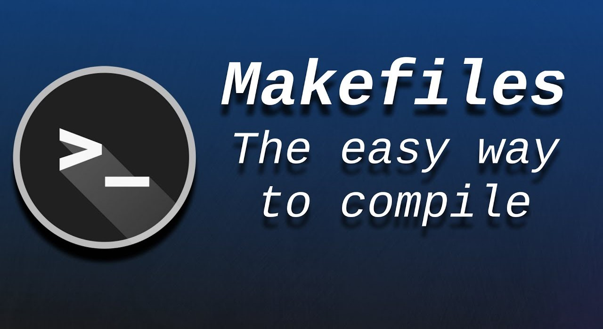

<div align="center">
<br>



</div>


<p align="center">


</p>


<h1 align="center"> C - Makefiles </h1>


<h3 align="center">
<a href="https://github.com/SuleimanHajizadeh/holbertonschool-low_level_programming/tree/master/makefiles#eye-about">About</a> •
<a href="https://github.com/SuleimanHajizadeh/holbertonschool-low_level_programming/tree/master/makefiles#hammer_and_wrench-tasks">Tasks</a> •
<a href="https://github.com/SuleimanHajizadeh/holbertonschool-low_level_programming/tree/master/makefiles#memo-learning-objectives">Learning Objectives</a> •
<a href="https://github.com/SuleimanHajizadeh/holbertonschool-low_level_programming/tree/master/makefiles#computer-requirements">Requirements</a> •
<a href="https://github.com/SuleimanHajizadeh/holbertonschool-low_level_programming/tree/master/makefiles#keyboard-more-info">More Info</a> •
<a href="https://github.com/SuleimanHajizadeh/holbertonschool-low_level_programming/tree/master/makefiles#mag_right-resources">Resources</a> •
<a href="https://github.com/SuleimanHajizadeh/holbertonschool-low_level_programming/tree/master/makefiles#bust_in_silhouette-authors">Authors</a> •
<a href="https://github.com/SuleimanHajizadeh/holbertonschool-low_level_programming/tree/master/makefiles#octocat-license">License</a>
</h3>

---

<!-- ------------------------------------------------------------------------------------------------- -->

<br>
<br>

## :eye: About

<br>

<div align="center">

**`C - makefiles`** theme focuses on creating and using Makefiles to automate the compilation process of C programs.
<br>
The programs demonstrate various features of Makefiles, such as defining variables, rules, and phony targets, as well as using compiler flags and handling dependencies between source files and object files.
<br>
<br>
This project has been created by **[Holberton School](https://www.holbertonschool.com/about-holberton)** to enable every student to understand how C language works.

</div>

<br>
<br>

<!-- ------------------------------------------------------------------------------------------------- -->

## :hammer_and_wrench: Tasks

<br>

**`0. make -f 0-Makefile`**

**`1. make -f 1-Makefile`**

**`2. make -f 2-Makefile`**

**`3. make -f 3-Makefile`**

**`4. A complete Makefile`**

**`5. make -f 100-Makefile`**

<br>
<br>

<!-- ------------------------------------------------------------------------------------------------- -->

## :memo: Learning Objectives

<br>

**_You are expected to be able to [explain to anyone](https://fs.blog/feynman-learning-technique/), without the help of Google:_**

<br>

```diff

General

+ What are make, Makefiles

+ When, why and how to use Makefiles

+ What are rules and how to set and use them

+ What are explicit and implicit rules

+ What are the most common / useful rules

+ What are variables and how to set and use them

```

<br>
<br>

<!-- ------------------------------------------------------------------------------------------------- -->

## :computer: Requirements

<br>

```diff

General

+ Allowed editors: vi, vim, emacs

+ OS: Ubuntu 20.04 LTS

+ Version of gcc: 9.3.0

+ Version of make: GNU Make 4.2.1

+ All your files should end with a new line

+ A README.md file, at the root of the folder of the project, is mandatory

```

<br>

**_Why all your files should end with a new line? See [HERE](https://unix.stackexchange.com/questions/18743/whats-the-point-in-adding-a-new-line-to-the-end-of-a-file/18789)_**

<br>
<br>

<!-- ------------------------------------------------------------------------------------------------- -->

## :keyboard: More Info

<br>

- :warning: **The following are very important steps:** <br><br>

  - In the following tasks, we are going to use [these files](https://github.com/hs-hq/0x1B.c). <br> 
  We want to compile these only.
  <br>

  - You can either create the files of the repository into your project folder (**makefiles**) and copy paste their content from github <br>
  **OR** you can clone the **0x1B.c** repository into the **makefiles** folder.
  <br>

  - If you’re going to clone it, you should enter the **makefiles** folder and **inside this folder** delete the **.git** folder using this command <br>
  `rm -rf .git`, then move the files from this folder into the **makefiles** folder to test your work.

<br>
<br>

<!-- ------------------------------------------------------------------------------------------------- -->

## :mag_right: Resources

<br>

**_Do you need some help?_**

<br>

**Read or watch:**

* [Makefile](https://www.google.com/search?q=makefile)

* [Makefiletutorial](https://makefiletutorial.com/)

<br>
<br>

<!-- ------------------------------------------------------------------------------------------------- -->

## :bust_in_silhouette: Authors

<br>


<br>
<br>

<!-- ------------------------------------------------------------------------------------------------- -->

## :octocat: License

<br>

```C - makefiles``` _project has no license specified._

<br>
<br>

---

<p align="center"><br>2025</p>
