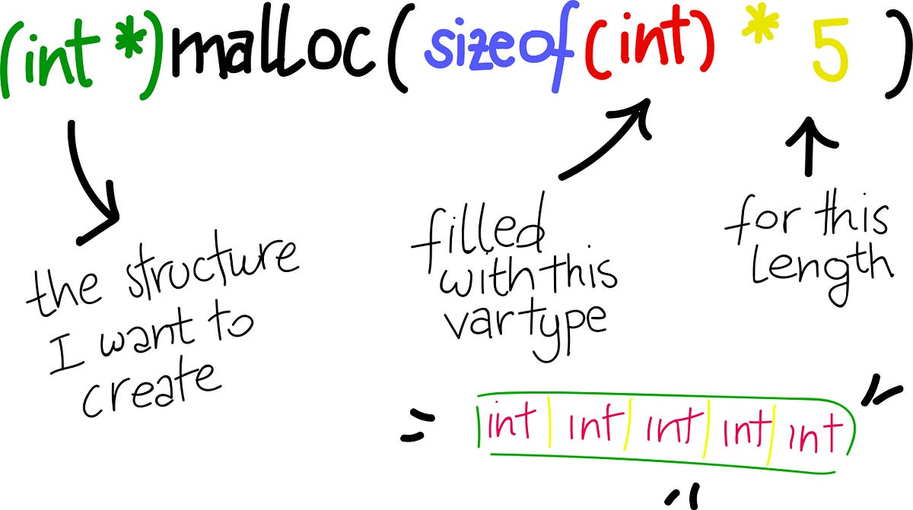

<div align="center">
<br>



</div>


<p align="center">


</p>


<h1 align="center"> C - malloc, free </h1>


<h3 align="center">
<a href="https://github.com/SuleimanHajizadeh/holbertonschool-low_level_programming/tree/master/malloc_free#eye-about">About</a> •
<a href="https://github.com/SuleimanHajizadeh/holbertonschool-low_level_programming/tree/master/malloc_free#hammer_and_wrench-tasks">Tasks</a> •
<a href="https://github.com/SuleimanHajizadeh/holbertonschool-low_level_programming/tree/master/malloc_free#memo-learning-objectives">Learning Objectives</a> •
<a href="https://github.com/SuleimanHajizadeh/holbertonschool-low_level_programming/tree/master/malloc_free#computer-requirements">Requirements</a> •
<a href="https://github.com/SuleimanHajizadeh/holbertonschool-low_level_programming/tree/master/malloc_free#keyboard-more-info">More Info</a> •
<a href="https://github.com/SuleimanHajizadeh/holbertonschool-low_level_programming/tree/master/malloc_free#mag_right-resources">Resources</a> •
<a href="https://github.com/SuleimanHajizadeh/holbertonschool-low_level_programming/tree/master/malloc_free#bust_in_silhouette-authors">Authors</a> •
<a href="https://github.com/SuleimanHajizadeh/holbertonschool-low_level_programming/tree/master/malloc_free#octocat-license">License</a>
</h3>

---

<!-- ------------------------------------------------------------------------------------------------- -->

<br>
<br>

## :eye: About

<br>

<div align="center">

**`C - malloc, free`** theme explores dynamic memory allocation and deallocation in C programming, introducing the concepts of heap memory and manual memory management.
<br>
The programs implement various functions for creating and manipulating dynamically allocated arrays and strings, including tasks such as creating character arrays, duplicating strings, concatenating strings, and creating 2D integer arrays, all while emphasizing proper memory allocation and deallocation using `malloc` and `free`.
<br>
<br>
This project has been created by **[Holberton School](https://www.holbertonschool.com/about-holberton)** to enable every student to understand how C language works.

</div>

<br>
<br>

<!-- ------------------------------------------------------------------------------------------------- -->

## :hammer_and_wrench: Tasks

<br>

**`0. Float like a butterfly, sting like a bee`**

**`1. The woman who has no imagination has no wings`**

**`2. He who is not courageous enough to take risks will accomplish nothing in life`**

**`3. If you even dream of beating me you'd better wake up and apologize`**

**`4. It's not bragging if you can back it up`**

**`5. It isn't the mountains ahead to climb that wear you out; it's the pebble in your shoe`**

**`6. I will show you how great I am`**

<br>
<br>

<!-- ------------------------------------------------------------------------------------------------- -->

## :memo: Learning Objectives

<br>

**_You are expected to be able to [explain to anyone](https://fs.blog/feynman-learning-technique/), without the help of Google:_**

<br>

```diff

General

+ What is the difference between automatic and dynamic allocation

+ What is malloc and free and how to use them

+ Why and when use malloc

+ How to use valgrind to check for memory leak

```

<br>
<br>

<!-- ------------------------------------------------------------------------------------------------- -->

## :computer: Requirements

<br>

```diff

General

+ Allowed editors: vi, vim, emacs

+ All your files will be compiled on Ubuntu 20.04 LTS using gcc, using the options -Wall -Werror -Wextra -pedantic -std=gnu89

+ All your files should end with a new line

+ A README.md file, at the root of the folder of the project is mandatory

+ Your code should use the Betty style. It will be checked using betty-style.pl and betty-doc.pl

- You are not allowed to use global variables

+ No more than 5 functions per file

- You are not allowed to use the standard library. Any use of functions like printf, puts, etc… is forbidden

+ You are allowed to use _putchar

- You don’t have to push _putchar.c, we will use our file. If you do it won’t be taken into account

+ In the following examples, the main.c files are shown as examples. <br> You can use them to test your functions, but you don’t have to push them to your repo (if you do we won’t take them into account). <br> We will use our own main.c files at compilation. <br> Our main.c files might be different from the one shown in the examples

+ The prototypes of all your functions and the prototype of the function _putchar should be included in your header file called main.h

+ Don’t forget to push your header file

```

<br>

**_Why all your files should end with a new line? See [HERE](https://unix.stackexchange.com/questions/18743/whats-the-point-in-adding-a-new-line-to-the-end-of-a-file/18789)_**

<br>
<br>

<!-- ------------------------------------------------------------------------------------------------- -->

## :keyboard: More Info

<br>

- You do not have to learn about `calloc` and `realloc`.

<br>
<br>

<!-- ------------------------------------------------------------------------------------------------- -->

## :mag_right: Resources

<br>

**_Do you need some help?_**

<br>

**Concepts:**

* [Automatic and dynamic allocation, malloc and free](https://drive.google.com/file/d/11ORTNbA0KAlA1Dzht8UlAUfEZORZDJb4/view?usp=sharing)

<br>

**Read or watch:**

* [0x0a - malloc & free - quick overview.pdf](https://drive.google.com/file/d/13pIBNgJQZD9ybTxJ0yZfYuqWTUpwpfpP/view?usp=sharing)

* [Dynamic memory allocation in C - malloc calloc realloc free](https://www.youtube.com/watch?v=xDVC3wKjS64)

<br>

**`man` or `help`:**

* `malloc`

* `free`

<br>
<br>

<!-- ------------------------------------------------------------------------------------------------- -->

## :bust_in_silhouette: Authors

<br>


<br>
<br>

<!-- ------------------------------------------------------------------------------------------------- -->

## :octocat: License

<br>

```C - malloc, free``` _project has no license specified._

<br>
<br>

---

<p align="center"><br>2025</p>
