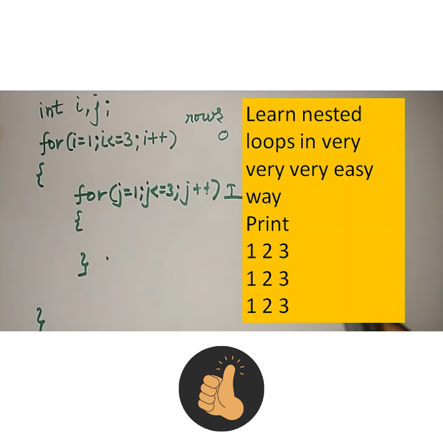

<div align="center">
<br>



</div>


<p align="center">


</p>


<h1 align="center"> C - More functions, more nested loops </h1>


<h3 align="center">
<a href="https://github.com/RazikaBengana/holbertonschool-low_level_programming/tree/main/more_functions_nested_loops#eye-about">About</a> •
<a href="https://github.com/RazikaBengana/holbertonschool-low_level_programming/tree/main/more_functions_nested_loops#hammer_and_wrench-tasks">Tasks</a> •
<a href="https://github.com/RazikaBengana/holbertonschool-low_level_programming/tree/main/more_functions_nested_loops#memo-learning-objectives">Learning Objectives</a> •
<a href="https://github.com/RazikaBengana/holbertonschool-low_level_programming/tree/main/more_functions_nested_loops#computer-requirements">Requirements</a> •
<a href="https://github.com/RazikaBengana/holbertonschool-low_level_programming/tree/main/more_functions_nested_loops#keyboard-more-info">More Info</a> •
<a href="https://github.com/RazikaBengana/holbertonschool-low_level_programming/tree/main/more_functions_nested_loops#mag_right-resources">Resources</a> •
<a href="https://github.com/RazikaBengana/holbertonschool-low_level_programming/tree/main/more_functions_nested_loops#bust_in_silhouette-authors">Authors</a> •
<a href="https://github.com/RazikaBengana/holbertonschool-low_level_programming/tree/main/more_functions_nested_loops#octocat-license">License</a>
</h3>

---

<!-- ------------------------------------------------------------------------------------------------- -->

<br>
<br>

## :eye: About

<br>

<div align="center">

**`C - more functions, more nested loops`** theme builds upon the previous concepts with more advanced function implementations and loop structures.
<br>
The programs focus on tasks such as checking for uppercase characters and digits, multiplying integers, printing specific number patterns, and creating geometric shapes (like lines, diagonals, squares, and triangles) using nested loops, demonstrating a progression in complexity.
<br>
<br>
This project has been created by **[Holberton School](https://www.holbertonschool.com/about-holberton)** to enable every student to understand how C language works.

</div>

<br>
<br>

<!-- ------------------------------------------------------------------------------------------------- -->

## :hammer_and_wrench: Tasks

<br>

**`0. isupper`**

**`1. isdigit`**

**`2. Collaboration is multiplication`**

**`3. The numbers speak for themselves`**

**`4. I believe in numbers and signs`**

**`5. Numbers constitute the only universal language`**

**`6. The shortest distance between two points is a straight line`**

**`7. I feel like I am diagonally parked in a parallel universe`**

**`8. You are so much sunshine in every square inch`**

**`9. Fizz-Buzz`**

**`10. Triangles`**

**`11. The problem of distinguishing prime numbers from composite numbers and of resolving the latter`** <br>
**`    into their prime factors is known to be one of the most important and useful in arithmetic`**

**`12. Numbers have life; they're not just symbols on paper`**

<br>
<br>

<!-- ------------------------------------------------------------------------------------------------- -->

## :memo: Learning Objectives

<br>

**_You are expected to be able to [explain to anyone](https://fs.blog/feynman-learning-technique/), without the help of Google:_**

<br>

```diff

General

+ What are nested loops and how to use them

+ What is a function and how do you use functions

+ What is the difference between a declaration and a definition of a function

+ What is a prototype

+ Scope of variables

+ What are the gcc flags -Wall -Werror -pedantic -Wextra -std=gnu89

+ What are header files and how to to use them with #include

```

<br>
<br>

<!-- ------------------------------------------------------------------------------------------------- -->

## :computer: Requirements

<br>

```diff

General

+ Allowed editors: vi, vim, emacs

+ All your files will be compiled on Ubuntu 20.04 LTS using gcc, using the options -Wall -Werror -Wextra -pedantic -std=gnu89

+ All your files should end with a new line

+ A README.md file, at the root of the folder of the project is mandatory

+ Your code should use the Betty style. It will be checked using betty-style.pl and betty-doc.pl

- You are not allowed to use global variables

+ No more than 5 functions per file

- You are not allowed to use the standard library. Any use of functions like printf, puts, etc… is forbidden

+ You are allowed to use _putchar

- You don’t have to push _putchar.c, we will use our file. If you do it won’t be taken into account

+ In the following examples, the main.c files are shown as examples. <br> You can use them to test your functions, but you don’t have to push them to your repo (if you do we won’t take them into account). <br> We will use our own main.c files at compilation. <br> Our main.c files might be different from the one shown in the examples

+ The prototypes of all your functions and the prototype of the function _putchar should be included in your header file called main.h

+ Don’t forget to push your header file

```

<br>

**_Why all your files should end with a new line? See [HERE](https://unix.stackexchange.com/questions/18743/whats-the-point-in-adding-a-new-line-to-the-end-of-a-file/18789)_**

<br>
<br>

<!-- ------------------------------------------------------------------------------------------------- -->

## :keyboard: More Info

<br>

- You do not have to understand the **call by reference (address)**, **stack**, **static variables**, **recursions** or **arrays**, yet.

<br>
<br>

<!-- ------------------------------------------------------------------------------------------------- -->

## :mag_right: Resources

<br>

**_Do you need some help?_**

<br>

**Read or watch:**

* [Nested while loops](https://www.youtube.com/watch?v=Z3iGeQ1gIss)

* [C - Functions](https://www.tutorialspoint.com/cprogramming/c_functions.htm)

* [Learning to Program in C (Part 06)](https://www.youtube.com/watch?v=qMlnFwYdqIw)

* [What is the purpose of a function prototype?](https://www.geeksforgeeks.org/what-is-the-purpose-of-a-function-prototype/)

* [C - Header Files](https://www.tutorialspoint.com/cprogramming/c_header_files.htm)

<br>
<br>

<!-- ------------------------------------------------------------------------------------------------- -->

## :bust_in_silhouette: Authors

<br>


<br>
<br>

<!-- ------------------------------------------------------------------------------------------------- -->

## :octocat: License

<br>

```C - more functions, more nested loops``` _project has no license specified._

<br>
<br>

---

<p align="center"><br>2022</p>