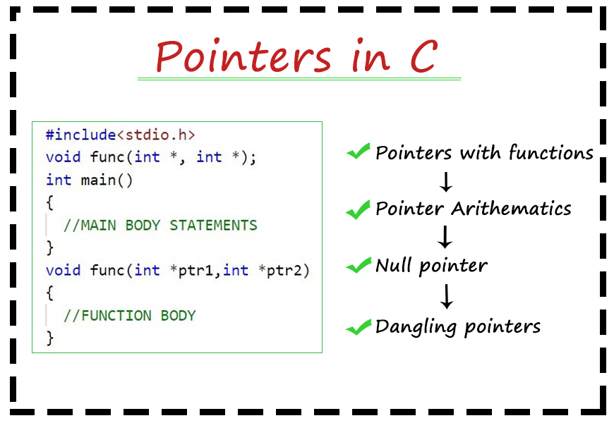

<div align="center">
<br>



</div>


<p align="center">


</p>


<h1 align="center"> C - More pointers, arrays and strings </h1>


<h3 align="center">
<a href="https://github.com/RazikaBengana/holbertonschool-low_level_programming/tree/main/more_pointers_arrays_strings#eye-about">About</a> •
<a href="https://github.com/RazikaBengana/holbertonschool-low_level_programming/tree/main/more_pointers_arrays_strings#hammer_and_wrench-tasks">Tasks</a> •
<a href="https://github.com/RazikaBengana/holbertonschool-low_level_programming/tree/main/more_pointers_arrays_strings#memo-learning-objectives">Learning Objectives</a> •
<a href="https://github.com/RazikaBengana/holbertonschool-low_level_programming/tree/main/more_pointers_arrays_strings#computer-requirements">Requirements</a> •
<a href="https://github.com/RazikaBengana/holbertonschool-low_level_programming/tree/main/more_pointers_arrays_strings#keyboard-more-info">More Info</a> •
<a href="https://github.com/RazikaBengana/holbertonschool-low_level_programming/tree/main/more_pointers_arrays_strings#mag_right-resources">Resources</a> •
<a href="https://github.com/RazikaBengana/holbertonschool-low_level_programming/tree/main/more_pointers_arrays_strings#bust_in_silhouette-authors">Authors</a> •
<a href="https://github.com/RazikaBengana/holbertonschool-low_level_programming/tree/main/more_pointers_arrays_strings#octocat-license">License</a>
</h3>

---

<!-- ------------------------------------------------------------------------------------------------- -->

<br>
<br>

## :eye: About

<br>

<div align="center">

**`C - more pointers, arrays and strings`** theme expands on the previous concepts with more advanced string and array manipulations.
<br>
The programs focus on sophisticated operations such as string concatenation, copying, comparison, character case conversion, encoding (leet and rot13), as well as more complex tasks like printing integers and handling infinite addition with buffers.
<br>
<br>
This project has been created by **[Holberton School](https://www.holbertonschool.com/about-holberton)** to enable every student to understand how C language works.

</div>

<br>
<br>

<!-- ------------------------------------------------------------------------------------------------- -->

## :hammer_and_wrench: Tasks

<br>

**`0. strcat`**

**`1. strncat`**

**`2. strncpy`**

**`3. strcmp`**

**`4. I am a kind of paranoid in reverse. I suspect people of plotting to make me happy`**

**`5. Always look up`**

**`6. Expect the best. Prepare for the worst. Capitalize on what comes`**

**`7. Mozart composed his music not for the elite, but for everybody`**

**`8. rot13`**

**`9. Numbers have life; they're not just symbols on paper`**

**`10. A dream doesn't become reality through magic; it takes sweat, determination and hard work`**

**`11. It is the addition of strangeness to beauty that constitutes the romantic character in art`**

**`12. Noise is a buffer, more effective than cubicles or booth walls`**

<br>
<br>

<!-- ------------------------------------------------------------------------------------------------- -->

## :memo: Learning Objectives

<br>

**_You are expected to be able to [explain to anyone](https://fs.blog/feynman-learning-technique/), without the help of Google:_**

<br>

```diff

General

+ What are pointers and how to use them

+ What are arrays and how to use them

+ What are the differences between pointers and arrays

+ How to use strings and how to manipulate them

+ Scope of variables

```

<br>
<br>

<!-- ------------------------------------------------------------------------------------------------- -->

## :computer: Requirements

<br>

```diff

General

+ Allowed editors: vi, vim, emacs

+ All your files will be compiled on Ubuntu 20.04 LTS using gcc, using the options -Wall -Werror -Wextra -pedantic -std=gnu89

+ All your files should end with a new line

+ A README.md file, at the root of the folder of the project is mandatory

+ Your code should use the Betty style. It will be checked using betty-style.pl and betty-doc.pl

- You are not allowed to use global variables

+ No more than 5 functions per file

- You are not allowed to use the standard library. Any use of functions like printf, puts, etc… is forbidden

+ You are allowed to use _putchar

- You don’t have to push _putchar.c, we will use our file. If you do it won’t be taken into account

+ In the following examples, the main.c files are shown as examples. <br> You can use them to test your functions, but you don’t have to push them to your repo (if you do we won’t take them into account). <br> We will use our own main.c files at compilation. <br> Our main.c files might be different from the one shown in the examples

+ The prototypes of all your functions and the prototype of the function _putchar should be included in your header file called main.h

+ Don’t forget to push your header file

```

<br>

**_Why all your files should end with a new line? See [HERE](https://unix.stackexchange.com/questions/18743/whats-the-point-in-adding-a-new-line-to-the-end-of-a-file/18789)_**

<br>
<br>

<!-- ------------------------------------------------------------------------------------------------- -->

## :keyboard: More Info

<br>

- You do not need to learn about **pointers to functions**, **pointers to pointers**, **multidimensional arrays**, **arrays of structures**, `malloc` and `free` yet.

<br>
<br>

<!-- ------------------------------------------------------------------------------------------------- -->

## :mag_right: Resources

<br>

**_Do you need some help?_**

<br>

**Concepts:**

* [Pointers and arrays](https://drive.google.com/file/d/11GfkaqCZ-O9rUq_8I-1aAGIjQ0RNpAU5/view?usp=sharing)

* [Data structures](https://drive.google.com/file/d/11G_xtb5oHwnp5zEM8gSp3Q9W6fTb02cQ/view?usp=sharing)

<br>

**Read or watch:**

* [C - Arrays](https://www.tutorialspoint.com/cprogramming/c_arrays.htm)

* [C - Pointers](https://www.tutorialspoint.com/cprogramming/c_pointers.htm)

* [C - Strings](https://www.tutorialspoint.com/cprogramming/c_strings.htm)

* [Memory Layout](https://aticleworld.com/memory-layout-of-c-program/)

<br>
<br>

<!-- ------------------------------------------------------------------------------------------------- -->

## :bust_in_silhouette: Authors

<br>


<br>
<br>

<!-- ------------------------------------------------------------------------------------------------- -->

## :octocat: License

<br>

```C - more pointers, arrays and strings``` _project has no license specified._

<br>
<br>

---

<p align="center"><br>2022</p>