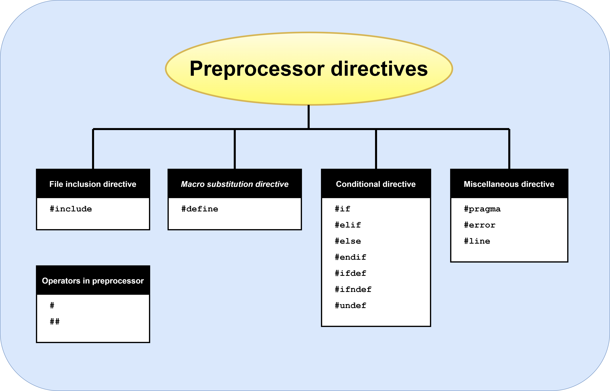

<div align="center">
<br>



</div>


<p align="center">


</p>


<h1 align="center"> C - Preprocessor </h1>


<h3 align="center">
<a href="https://github.com/SuleimanHajizadeh/holbertonschool-low_level_programming/tree/master/preprocessor#eye-about">About</a> •
<a href="https://github.com/SuleimanHajizadeh/holbertonschool-low_level_programming/tree/master/preprocessor#hammer_and_wrench-tasks">Tasks</a> •
<a href="https://github.com/SuleimanHajizadeh/holbertonschool-low_level_programming/tree/master/preprocessor#memo-learning-objectives">Learning Objectives</a> •
<a href="https://github.com/SuleimanHajizadeh/holbertonschool-low_level_programming/tree/master/preprocessor#computer-requirements">Requirements</a> •
<a href="https://github.com/SuleimanHajizadeh/holbertonschool-low_level_programming/tree/master/preprocessor#mag_right-resources">Resources</a> •
<a href="https://github.com/SuleimanHajizadeh/holbertonschool-low_level_programming/tree/master/preprocessor#bust_in_silhouette-authors">Authors</a> •
<a href="https://github.com/SuleimanHajizadeh/holbertonschool-low_level_programming/tree/master/preprocessor#octocat-license">License</a>
</h3>

---

<!-- ------------------------------------------------------------------------------------------------- -->

<br>
<br>

## :eye: About

<br>

<div align="center">

**`C - preprocessor`** theme explores the use of preprocessor directives and macros in C programming, focusing on how to manipulate code before compilation.
<br>
The programs demonstrate the creation and usage of object-like macros, function-like macros, and header files to define constants, perform calculations, and control code compilation, showcasing how the preprocessor can be used to improve code flexibility and maintainability.
<br>
<br>
This project has been created by **[Holberton School](https://www.holbertonschool.com/about-holberton)** to enable every student to understand how C language works.

</div>

<br>
<br>

<!-- ------------------------------------------------------------------------------------------------- -->

## :hammer_and_wrench: Tasks

<br>

**`0. Object-like Macro`**

**`1. Pi`**

**`2. File name`**

**`3. Function-like macro`**

**`4. SUM`**

<br>
<br>

<!-- ------------------------------------------------------------------------------------------------- -->

## :memo: Learning Objectives

<br>

**_You are expected to be able to [explain to anyone](https://fs.blog/feynman-learning-technique/), without the help of Google:_**

<br>

```diff

General

+ What are macros and how to use them

+ What are the most common predefined macros

+ How to include guard your header files

```

<br>
<br>

<!-- ------------------------------------------------------------------------------------------------- -->

## :computer: Requirements

<br>

```diff

General

+ Allowed editors: vi, vim, emacs

+ All your files will be compiled on Ubuntu 20.04 LTS using gcc, using the options -Wall -Werror -Wextra -pedantic -std=gnu89

+ All your files should end with a new line

+ A README.md file, at the root of the folder of the project is mandatory

+ Your code should use the Betty style. It will be checked using betty-style.pl and betty-doc.pl

- You are not allowed to use global variables

+ No more than 5 functions per file

+ The only C standard library functions allowed are malloc, free and exit

- Any use of functions like printf, puts, calloc, realloc etc… is forbidden

+ You are allowed to use _putchar

- You don’t have to push _putchar.c, we will use our file. If you do it won’t be taken into account

+ In the following examples, the main.c files are shown as examples. <br> You can use them to test your functions, but you don’t have to push them to your repo (if you do we won’t take them into account). <br> We will use our own main.c files at compilation. <br> Our main.c files might be different from the one shown in the examples

+ Don’t forget to push your header file

+ All your header files should be include guarded

```

<br>

**_Why all your files should end with a new line? See [HERE](https://unix.stackexchange.com/questions/18743/whats-the-point-in-adding-a-new-line-to-the-end-of-a-file/18789)_**

<br>
<br>

<!-- ------------------------------------------------------------------------------------------------- -->

## :mag_right: Resources

<br>

**_Do you need some help?_**

<br>

**Read or watch:**

* [Understanding C program Compilation Process](https://www.youtube.com/watch?v=VDslRumKvRA)

* [Object-like Macros](https://gcc.gnu.org/onlinedocs/gcc-5.1.0/cpp/Object-like-Macros.html#Object-like-Macros)

* [Macro Arguments](https://gcc.gnu.org/onlinedocs/gcc-5.1.0/cpp/Macro-Arguments.html#Macro-Arguments)

* [Pre Processor Directives in C](https://www.youtube.com/watch?v=X6HiYbY3Uak)

* [The C Preprocessor](https://www.cprogramming.com/tutorial/cpreprocessor.html)

* [Standard Predefined Macros](https://gcc.gnu.org/onlinedocs/gcc-5.1.0/cpp/Standard-Predefined-Macros.html#Standard-Predefined-Macros)

* [include guard](https://en.wikipedia.org/wiki/Include_guard)

* [Common Predefined Macros](https://gcc.gnu.org/onlinedocs/gcc-5.1.0/cpp/Common-Predefined-Macros.html#Common-Predefined-Macros)

<br>
<br>

<!-- ------------------------------------------------------------------------------------------------- -->

## :bust_in_silhouette: Authors

<br>


<br>
<br>

<!-- ------------------------------------------------------------------------------------------------- -->

## :octocat: License

<br>

```C - preprocessor``` _project has no license specified._

<br>
<br>

---

<p align="center"><br>2025</p>
