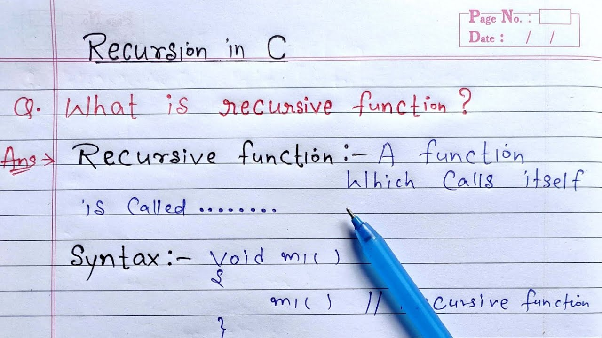

<div align="center">
<br>


</div>


<p align="center">


</p>


<h1 align="center"> C - Recursion </h1>


<h3 align="center">
<a href="https://github.com/SuleimanHajizadeh/holbertonschool-low_level_programming/tree/master/recursion#eye-about">About</a> •
<a href="https://github.com/SuleimanHajizadeh/holbertonschool-low_level_programming/tree/master/recursion#hammer_and_wrench-tasks">Tasks</a> •
<a href="https://github.com/SuleimanHajizadeh/holbertonschool-low_level_programming/tree/master/recursion#memo-learning-objectives">Learning Objectives</a> •
<a href="https://github.com/SuleimanHajizadeh/holbertonschool-low_level_programming/tree/master/recursion#computer-requirements">Requirements</a> •
<a href="https://github.com/SuleimanHajizadeh/holbertonschool-low_level_programming/tree/master/recursion#mag_right-resources">Resources</a> •
<a href="https://github.com/SuleimanHajizadeh/holbertonschool-low_level_programming/tree/master/recursion#bust_in_silhouette-authors">Authors</a> •
<a href="https://github.com/SuleimanHajizadeh/holbertonschool-low_level_programming/tree/master/recursion#octocat-license">License</a>
</h3>

---

<!-- ------------------------------------------------------------------------------------------------- -->

<br>
<br>

## :eye: About

<br>

<div align="center">

**`C - recursion`** theme explores the powerful concept of functions calling themselves to solve complex problems by breaking them down into simpler, self-similar subproblems.
<br>
The programs implement various recursive functions for tasks such as printing strings, calculating string length, factorials, powers, and square roots, as well as more advanced operations like checking for prime numbers, palindromes, and comparing strings with wildcard characters, demonstrating the elegance and versatility of recursive problem-solving in C programming.
<br>
<br>
This project has been created by **[Holberton School](https://www.holbertonschool.com/about-holberton)** to enable every student to understand how C language works.

</div>

<br>
<br>

<!-- ------------------------------------------------------------------------------------------------- -->

## :hammer_and_wrench: Tasks

<br>

**`0. She locked away a secret, deep inside herself, something she once knew to be true... but chose to forget`**

**`2. Dreams feel real while we're in them. It's only when we wake up that we realize something was actually strange`**

**`3. You mustn't be afraid to dream a little bigger, darling`**

**`4. Once an idea has taken hold of the brain it's almost impossible to eradicate`**

**`5. Your subconscious is looking for the dreamer`**

**`6. Inception. Is it possible?`**

**`7. They say we only use a fraction of our brain's true potential. Now that's when we're awake. When we're asleep,`** <br>
**`   we can do almost anything`**

**`8. Inception. Now, before you bother telling me it's impossible...`**

<br>
<br>

<!-- ------------------------------------------------------------------------------------------------- -->

## :memo: Learning Objectives

<br>

**_You are expected to be able to [explain to anyone](https://fs.blog/feynman-learning-technique/), without the help of Google:_**

<br>

```diff

General

+ What is recursion

+ How to implement recursion

+ In what situations you should implement recursion

+ In what situations you shouldn’t implement recursion

```

<br>
<br>

<!-- ------------------------------------------------------------------------------------------------- -->

## :computer: Requirements

<br>

```diff

General

+ Allowed editors: vi, vim, emacs

+ All your files will be compiled on Ubuntu 20.04 LTS using gcc, using the options -Wall -Werror -Wextra -pedantic -std=gnu89

+ All your files should end with a new line

+ A README.md file, at the root of the folder of the project is mandatory

+ Your code should use the Betty style. It will be checked using betty-style.pl and betty-doc.pl

- You are not allowed to use global variables

+ No more than 5 functions per file

- You are not allowed to use the standard library. Any use of functions like printf, puts, etc… is forbidden

+ You are allowed to use _putchar

- You don’t have to push _putchar.c, we will use our file. If you do it won’t be taken into account

+ In the following examples, the main.c files are shown as examples. <br> You can use them to test your functions, but you don’t have to push them to your repo (if you do we won’t take them into account). <br> We will use our own main.c files at compilation. <br> Our main.c files might be different from the one shown in the examples

+ The prototypes of all your functions and the prototype of the function _putchar should be included in your header file called main.h

+ Don’t forget to push your header file

- You are not allowed to use any kind of loops

- You are not allowed to use static variables

```

<br>

**_Why all your files should end with a new line? See [HERE](https://unix.stackexchange.com/questions/18743/whats-the-point-in-adding-a-new-line-to-the-end-of-a-file/18789)_**

<br>
<br>

<!-- ------------------------------------------------------------------------------------------------- -->

## :mag_right: Resources

<br>

**_Do you need some help?_**

<br>

**Read or watch:**

* [Recursion, introduction](https://drive.google.com/file/d/13a0fhzeupSFVGPMKWFAQLbXvMEH8MBFa/view?usp=sharing)

* [What on Earth is Recursion?](https://www.youtube.com/watch?v=Mv9NEXX1VHc)

* [C - Recursion](https://www.tutorialspoint.com/cprogramming/c_recursion.htm)

* [C Programming Tutorial 85, Recursion pt.1](https://www.youtube.com/watch?v=XGxbXMP6k8k)

* [C Programming Tutorial 86, Recursion pt.2](https://www.youtube.com/watch?v=7XiIS6HobNs)

<br>
<br>

<!-- ------------------------------------------------------------------------------------------------- -->

## :bust_in_silhouette: Authors

<br>


<br>
<br>

<!-- ------------------------------------------------------------------------------------------------- -->

## :octocat: License

<br>

```C - recursion``` _project has no license specified._

<br>
<br>

---

<p align="center"><br>2025</p>
