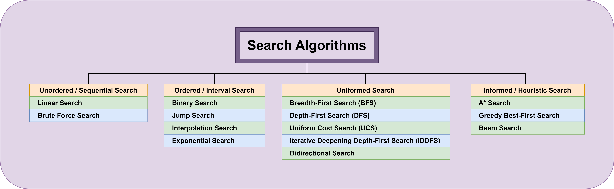

<div align="center">
<br>



</div>


<p align="center">


</p>


<h1 align="center"> C - search Algorithms </h1>


<h3 align="center">
<a href="https://github.com/SuleimanHajizadeh/holbertonschool-low_level_programming/tree/master/search_algorithms#eye-about">About</a> •
<a href="https://github.com/SuleimanHajizadeh/holbertonschool-low_level_programming/tree/master/search_algorithms#hammer_and_wrench-tasks">Tasks</a> •
<a href="https://github.com/SuleimanHajizadeh/holbertonschool-low_level_programming/tree/master/search_algorithms#memo-learning-objectives">Learning Objectives</a> •
<a href="https://github.com/SuleimanHajizadeh/holbertonschool-low_level_programming/tree/master/search_algorithms#computer-requirements">Requirements</a> •
<a href="https://github.com/SuleimanHajizadeh/holbertonschool-low_level_programming/tree/master/search_algorithms#keyboard-more-info">More Info</a> •
<a href="https://github.com/SuleimanHajizadeh/holbertonschool-low_level_programming/tree/master/search_algorithms#mag_right-resources">Resources</a> •
<a href="https://github.com/SuleimanHajizadeh/holbertonschool-low_level_programming/tree/master/search_algorithms#bust_in_silhouette-authors">Authors</a> •
<a href="https://github.com/SuleimanHajizadeh/holbertonschool-low_level_programming/tree/master/search_algorithms#octocat-license">License</a>
</h3>

---

<!-- ------------------------------------------------------------------------------------------------- -->

<br>
<br>

## :eye: About

<br>

<div align="center">

**`C - search algorithms`** theme explores various search techniques for finding specific values in arrays and linked lists.
<br>
<br>
The programs implement and analyze different search algorithms such as linear search, binary search, jump search, interpolation search, exponential search, and advanced binary search, along with their `time` and `space` complexities.
<br>
<br>
This project has been created by **[Holberton School](https://www.holbertonschool.com/about-holberton)** to enable every student to understand how C language works.

</div>

<br>
<br>

<!-- ------------------------------------------------------------------------------------------------- -->

## :hammer_and_wrench: Tasks

<br>

**`0. Linear search`**

**`1. Binary search`**

**`2. Big O #0`**

**`3. Big O #1`**

**`4. Big O #2`**

**`5. Big O #3`**

**`6. Big O #4`**

**`7. Jump search`**

**`8. Big O #5`**

**`9. Interpolation search`**

**`10. Exponential search`**

**`11. Advanced binary search`**

**`12. Jump search in a singly linked list`**

**`13. Linear search in a skip list`**

**`14. Big O #6`**

**`15. Big O #7`**

<br>
<br>

<!-- ------------------------------------------------------------------------------------------------- -->

## :memo: Learning Objectives

<br>

**_You are expected to be able to [explain to anyone](https://fs.blog/feynman-learning-technique/), without the help of Google:_**

<br>

```diff

General

+ What is a search algorithm

+ What is a linear search

+ What is a binary search

+ What is the best search algorithm to use depending on your needs

```

<br>
<br>

<!-- ------------------------------------------------------------------------------------------------- -->

## :computer: Requirements

<br>

```diff

General

+ Allowed editors: vi, vim, emacs

+ All your files will be compiled on Ubuntu 20.04 LTS using gcc, using the options -Wall -Werror -Wextra -pedantic -std=gnu89

+ All your files should end with a new line

+ A README.md file, at the root of the folder of the project is mandatory

+ Your code should use the Betty style. It will be checked using betty-style.pl and betty-doc.pl

- You are not allowed to use global variables

+ No more than 5 functions per file

- You are only allowed to use the printf function of the standard library. Any call to another function like strdup, malloc, … is forbidden.

+ In the following examples, the main.c files are shown as examples. <br> You can use them to test your functions, but you don’t have to push them to your repo (if you do we won’t take them into account). <br> We will use our own main.c files at compilation. <br> Our main.c files might be different from the one shown in the examples

+ The prototypes of all your functions and the prototype of the function _putchar should be included in your header file called search_algos.h

+ Don’t forget to push your header file

+ All your header files should be include guarded

```

<br>

**_Why all your files should end with a new line? See [HERE](https://unix.stackexchange.com/questions/18743/whats-the-point-in-adding-a-new-line-to-the-end-of-a-file/18789)_**

<br>
<br>

<!-- ------------------------------------------------------------------------------------------------- -->

## :keyboard: More Info

<br>

- You will be asked to write files containing `big O` notations. <br>
Please use this format:

  - `O(1)`
  - `O(n)`
  - `O(n!)`
  - n*m -> `O(nm)`
  - n square -> `O(n^2)`
  - sqrt n -> `O(sqrt(n))`
  - log(n) -> `O(log(n))`
  - n * log(n) -> `O(nlog(n))`
  - …

<br>
<br>

<!-- ------------------------------------------------------------------------------------------------- -->

## :mag_right: Resources

<br>

**_Do you need some help?_**

<br>

**Read or watch:**

* [Search algorithm](https://en.wikipedia.org/wiki/Search_algorithm)

* [Space complexity (1)](https://www.geeksforgeeks.org/g-fact-86/)

<br>
<br>

<!-- ------------------------------------------------------------------------------------------------- -->

## :bust_in_silhouette: Authors

<br>


<br>
<br>

<!-- ------------------------------------------------------------------------------------------------- -->

## :octocat: License

<br>

```C - search algorithms``` _project has no license specified._

<br>
<br>

---

<p align="center"><br>2025</p>
