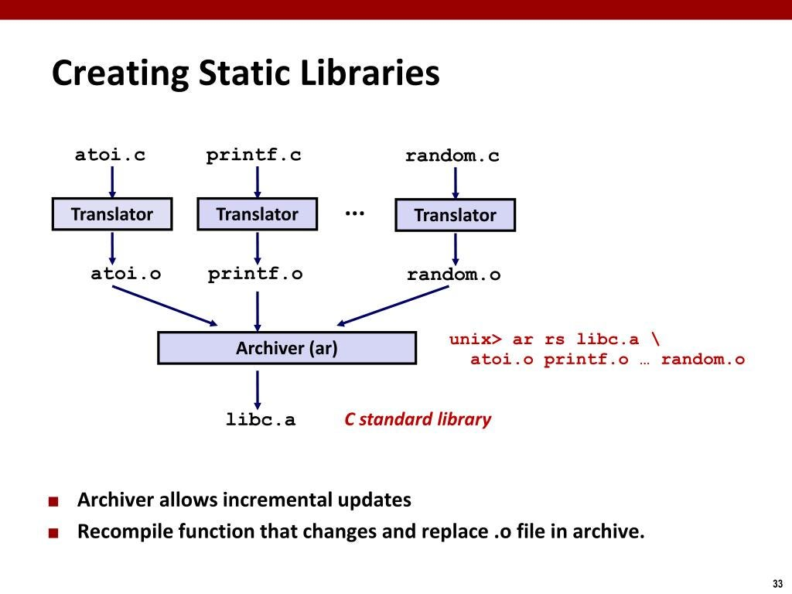

<div align="center">
<br>



</div>


<p align="center">


</p>


<h1 align="center"> C - Static libraries </h1>


<h3 align="center">
<a href="https://github.com/RazikaBengana/holbertonschool-low_level_programming/tree/main/static_libraries#eye-about">About</a> •
<a href="https://github.com/RazikaBengana/holbertonschool-low_level_programming/tree/main/static_libraries#hammer_and_wrench-tasks">Tasks</a> •
<a href="https://github.com/RazikaBengana/holbertonschool-low_level_programming/tree/main/static_libraries#memo-learning-objectives">Learning Objectives</a> •
<a href="https://github.com/RazikaBengana/holbertonschool-low_level_programming/tree/main/static_libraries#computer-requirements">Requirements</a> •
<a href="https://github.com/RazikaBengana/holbertonschool-low_level_programming/tree/main/static_libraries#keyboard-more-info">More Info</a> •
<a href="https://github.com/RazikaBengana/holbertonschool-low_level_programming/tree/main/static_libraries#mag_right-resources">Resources</a> •
<a href="https://github.com/RazikaBengana/holbertonschool-low_level_programming/tree/main/static_libraries#bust_in_silhouette-authors">Authors</a> •
<a href="https://github.com/RazikaBengana/holbertonschool-low_level_programming/tree/main/static_libraries#octocat-license">License</a>
</h3>

---

<!-- ------------------------------------------------------------------------------------------------- -->

<br>
<br>

## :eye: About

<br>

<div align="center">

**`C - static libraries`** theme focuses on creating and using static libraries in C programming.
<br>
The programs and scripts demonstrate how to create a static library from multiple C source files, compile programs that use the static library, and include a shell script that automates the process of creating a static library from all `.c` files in the current directory, showcasing the practical application of static libraries in C projects.
<br>
<br>
This project has been created by **[Holberton School](https://www.holbertonschool.com/about-holberton)** to enable every student to understand how C language works.

</div>

<br>
<br>

<!-- ------------------------------------------------------------------------------------------------- -->

## :hammer_and_wrench: Tasks

<br>

**`0. A library is not a luxury but one of the necessities of life`**

**`1. Without libraries what have we? We have no past and no future`**

<br>
<br>

<!-- ------------------------------------------------------------------------------------------------- -->

## :memo: Learning Objectives

<br>

**_You are expected to be able to [explain to anyone](https://fs.blog/feynman-learning-technique/), without the help of Google:_**

<br>

```diff

General

+ What is a static library, how does it work, how to create one, and how to use it

+ Basic usage of ar, ranlib, nm

```

<br>
<br>

<!-- ------------------------------------------------------------------------------------------------- -->

## :computer: Requirements

<br>

```diff

C

+ Allowed editors: vi, vim, emacs

+ All your files will be compiled on Ubuntu 20.04 LTS using gcc, using the options -Wall -Werror -Wextra -pedantic -std=gnu89

+ All your files should end with a new line

+ A README.md file, at the root of the folder of the project is mandatory

+ Your code should use the Betty style. It will be checked using betty-style.pl and betty-doc.pl

- You are not allowed to use global variables

+ No more than 5 functions per file

- You are not allowed to use the standard library. Any use of functions like printf, puts, etc… is forbidden

+ You are allowed to use _putchar

- You don’t have to push _putchar.c, we will use our file. If you do it won’t be taken into account

+ In the following examples, the main.c files are shown as examples. <br> You can use them to test your functions, but you don’t have to push them to your repo (if you do we won’t take them into account). <br> We will use our own main.c files at compilation. <br> Our main.c files might be different from the one shown in the examples

+ The prototypes of all your functions and the prototype of the function _putchar should be included in your header file called main.h

+ Don’t forget to push your header file


Bash

+ Allowed editors: vi, vim, emacs

+ All your scripts will be tested on Ubuntu 20.04 LTS

+ All your files should end with a new line

+ The first line of all your files should be exactly #!/bin/bash

+ A README.md file, at the root of the folder of the project, describing what each script is doing

+ All your files must be executable

```

<br>

**_Why all your files should end with a new line? See [HERE](https://unix.stackexchange.com/questions/18743/whats-the-point-in-adding-a-new-line-to-the-end-of-a-file/18789)_**

<br>
<br>

<!-- ------------------------------------------------------------------------------------------------- -->

## :keyboard: More Info

<br>

- You do not need to learn about **dynamic libraries**, yet.

<br>
<br>

<!-- ------------------------------------------------------------------------------------------------- -->

## :mag_right: Resources

<br>

**_Do you need some help?_**

<br>

**Concepts:**

* [C static libraries](https://drive.google.com/file/d/13ermuTb3wDWctsI8iHu3Fi-PpbkdRlgr/view?usp=sharing)

<br>

**Read or watch:**

* [What Is A “C” Library? What Is It Good For?](https://docencia.ac.upc.edu/FIB/USO/Bibliografia/unix-c-libraries.html)

* [Creating A Static “C” Library Using “ar” and “ranlib”](https://docencia.ac.upc.edu/FIB/USO/Bibliografia/unix-c-libraries.html)

* [Using A “C” Library In A Program](https://docencia.ac.upc.edu/FIB/USO/Bibliografia/unix-c-libraries.html)

* [What is difference between Dynamic and Static library(Static and Dynamic linking)](https://www.youtube.com/watch?v=eW5he5uFBNM)

<br>

**`man` or `help`:**

* `ar`

* `ranlib`

* `nm`

<br>
<br>

<!-- ------------------------------------------------------------------------------------------------- -->

## :bust_in_silhouette: Authors

<br>


<br>
<br>

<!-- ------------------------------------------------------------------------------------------------- -->

## :octocat: License

<br>

```C - static libraries``` _project has no license specified._

<br>
<br>

---

<p align="center"><br>2022</p>